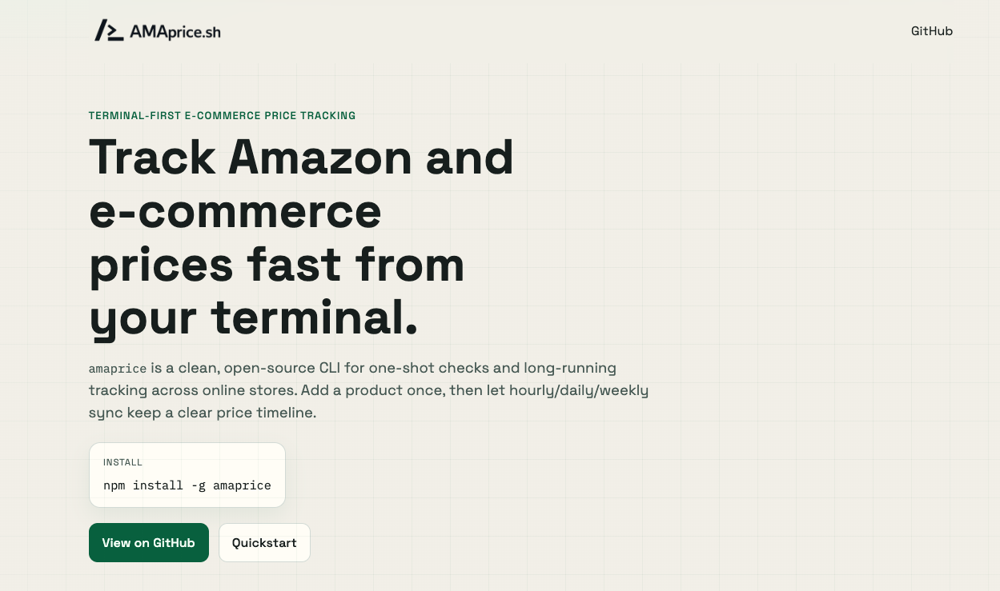

# AMAprice.sh - terminal first e-commerce price tracking

[](LICENSE)
[](https://nodejs.org/)
[](https://playwright.dev/)
[](https://supabase.com/)

`amaprice` is a terminal-first CLI to check e-commerce prices, track products, and build shared price history automatically.
It starts with Amazon support and will expand to Walmart and other major e-commerce stores.



## Install

Requires Node.js `>=20`.

```bash
npm install -g amaprice
```

First install downloads Playwright Chromium (via npm `postinstall`).

You can also run it without global install:

```bash
npx amaprice price "https://www.amazon.de/dp/B0DZ5P7JD6"
```

## Quickstart

```bash
# one-shot lookup
amaprice price "https://www.amazon.de/dp/B0DZ5P7JD6"

# start tracking with a tier
amaprice track B0DZ5P7JD6 --tier daily

# show history
amaprice history B0DZ5P7JD6 --limit 30

# list tracked products
amaprice list
```

## Input Modes

`price` and `track` accept input in three ways:
- direct argument (`amaprice price <url-or-asin>`)
- piped stdin (`echo "<url-or-asin>" | amaprice price`)
- interactive prompt (run command without argument)

Short links from Amazon apps (for example `amzn.eu`, `amzn.to`, `a.co`) are accepted and resolved automatically.

## Commands

| Command | Description |
|---|---|
| `amaprice [url\|asin]` | Shortcut for `amaprice price [url\|asin]` |
| `amaprice price [url\|asin]` | One-shot lookup and silent history insert |
| `amaprice track [url\|asin]` | Track product + current price (`--tier`, `--manual-tier`, `--auto-tier`, `--inactive`) |
| `amaprice history <url\|asin>` | Show history (`--limit N`) |
| `amaprice list` | List tracked products + latest price |
| `amaprice sync --limit <n>` | Run background sync for due products |
| `amaprice tier <url\|asin> <hourly\|daily\|weekly>` | Set tier/status (`--auto`, `--manual`, `--activate`, `--deactivate`) |

All commands support `--json`.

## Currently Supported Store

Amazon domains:
`amazon.de`, `amazon.com`, `amazon.co.uk`, `amazon.fr`, `amazon.it`, `amazon.es`, `amazon.nl`, `amazon.co.jp`, `amazon.ca`, `amazon.com.au`, `amazon.in`, `amazon.com.br`

## Outlook

- [x] Amazon (live now)
- [ ] Walmart (next)
- [ ] More major e-commerce stores after Walmart

Goal: bring multi-store price tracking into one terminal-first workflow.

## Testing

Run regression and parser tests:

```bash
npm test
```

## Tiered Background Model

Each product has:
- `tier`: `hourly`, `daily`, or `weekly`
- `tier_mode`: `auto` or `manual`
- `next_scrape_at`: when the worker should scrape next

How tiers are determined in `auto` mode:
- `hourly`: 2+ price changes in 48h, or >=5% change across 7 days
- `daily`: normal active products
- `weekly`: no observed change in 30 days

Worker behavior:
- claims due products
- scrapes with Playwright
- writes `price_history`
- writes `scrape_attempts` telemetry for block/error monitoring
- resets/backs off on failures
- updates next run with jitter

## Database Migration (Supabase)

Run this SQL in Supabase SQL Editor:

`supabase/migrations/20260220_add_tier_scheduler.sql`

`supabase/migrations/20260220_add_scrape_attempts.sql`

`supabase/migrations/20260220_add_worker_health_view.sql`

`supabase/migrations/20260220_grant_worker_health_select.sql`

`supabase/migrations/20260220_add_price_history_currency.sql`

These migrations add tier fields, indexes, telemetry, worker health rollups, and `price_history.currency`.

Note: these files are additive migrations and expect existing `products` + `price_history` tables.

## Block Detection Queries

Products currently failing or likely blocked:

```sql
select asin, tier, consecutive_failures, last_error, last_scraped_at, next_scrape_at
from products
where consecutive_failures >= 3
   or last_error ilike '%captcha%'
   or last_error ilike '%robot%'
   or last_error ilike '%503%'
order by consecutive_failures desc, next_scrape_at asc;
```

Hourly block-rate from telemetry:

```sql
select
  date_trunc('hour', scraped_at) as hour,
  count(*) as total,
  sum(case when blocked_signal then 1 else 0 end) as blocked,
  round(100.0 * sum(case when blocked_signal then 1 else 0 end) / nullif(count(*), 0), 2) as blocked_pct
from scrape_attempts
where scraped_at >= now() - interval '24 hours'
group by 1
order by 1 desc;
```

Single-row worker health view:

```sql
select * from worker_health;
```

## Local/Worker Environment

Use your own Supabase project for isolated data:

```bash
export SUPABASE_URL="https://<project-ref>.supabase.co"
export SUPABASE_KEY="<anon-or-service-role-key>"
```

Environment variables used by the npm package:

| Variable | Default | Used by | Notes |
|---|---|---|---|
| `SUPABASE_URL` | built-in public project URL | CLI + worker | Override for your own Supabase project |
| `SUPABASE_KEY` | built-in public anon key | CLI + worker | Preferred variable name |
| `SUPABASE_ANON_KEY` | none | CLI + worker | Alias fallback if `SUPABASE_KEY` is unset |
| `SYNC_INTERVAL_MINUTES` | `5` | `src/worker.js` | Worker loop interval |
| `SYNC_LIMIT` | `20` | `src/worker.js`, `amaprice sync --limit` | Max due products per run |
| `SYNC_RUN_ONCE` | `0` | `src/worker.js` | Set `1` for single run and exit |
| `VISION_FALLBACK_ENABLED` | `0` | `src/extractors/pipeline.js` | Enable screenshot + vision fallback when HTML/JSON extraction fails |
| `OPENROUTER_API_KEY` | none | `src/extractors/vision.js` | Preferred vision provider key |
| `VISION_MODEL` | `google/gemini-3-flash-preview` | `src/extractors/vision.js` | OpenRouter model ID for vision extraction |
| `VISION_PROVIDER` | auto | `src/extractors/vision.js` | Optional force value: `openrouter` or `openai` |
| `OPENROUTER_HTTP_REFERER` | none | `src/extractors/vision.js` | Optional OpenRouter attribution header |
| `OPENROUTER_TITLE` | none | `src/extractors/vision.js` | Optional OpenRouter attribution header |
| `VISION_GUARDRAIL_ENABLED` | `1` | `src/extractors/pipeline.js` | Reject suspicious vision outputs before DB writes |
| `VISION_GUARDRAIL_MIN_CONFIDENCE` | `0.92` | `src/extractors/pipeline.js` | Minimum confidence required for vision price acceptance |
| `VISION_GUARDRAIL_MAX_REL_DELTA` | `0.5` | `src/extractors/pipeline.js` | Max relative delta vs last known price before rejecting vision price |
| `OPENAI_API_KEY` | none | `src/extractors/vision.js` | Legacy fallback if `OPENROUTER_API_KEY` is unset |

For production background workers, prefer the Supabase **service role key**.

## Railway Worker Deployment

This repo includes:
- `src/worker.js` (long-running loop worker)
- `railway.json` + `Dockerfile` (Playwright-ready runtime)

Steps:
1. Create a Railway project from this repo.
2. Add env vars: `SUPABASE_URL`, `SUPABASE_KEY`.
3. Optional env vars:
   - `SYNC_INTERVAL_MINUTES=5`
   - `SYNC_LIMIT=20`
   - `VISION_FALLBACK_ENABLED=1`
   - `OPENROUTER_API_KEY=<your-openrouter-key>`
   - `VISION_MODEL=google/gemini-3-flash-preview`
   - `VISION_GUARDRAIL_ENABLED=1`
   - `VISION_GUARDRAIL_MIN_CONFIDENCE=0.92`
   - `VISION_GUARDRAIL_MAX_REL_DELTA=0.5`
4. Ensure builder is Dockerfile (root `Dockerfile`).
5. Deploy.
6. Confirm logs show `[worker] processed=...`.

If Railway still uses Railpack instead of Dockerfile, set builder to Dockerfile manually in Railway service settings and redeploy.

One-shot run for testing:

```bash
npm run worker:once
```

## Vercel Website Deployment (`amaprice.sh`)

Lean marketing site is a Next.js app in `website/`.

Steps:
1. Import the repo in Vercel.
2. Leave the project at repo root (deployment is controlled by root `vercel.json`).
3. Set website env vars:
   - `NEXT_PUBLIC_SUPABASE_URL`
   - `NEXT_PUBLIC_SUPABASE_ANON_KEY`
   - `NEXT_PUBLIC_GOOGLE_SITE_VERIFICATION` (for Google Search Console verification meta tag)
4. Deploy.
5. Add domain `amaprice.sh` in Vercel Domains and assign to this project.
6. Set `www.amaprice.sh` redirect to `amaprice.sh`.

Local website development:

```bash
cd website
npm install
npm run dev
```

## SEO + LLM Discoverability

The website includes:
- `https://amaprice.sh/robots.txt` (open crawl policy, no root blocking)
- `https://amaprice.sh/sitemap.xml` (canonical URLs for Google indexing)
- `https://amaprice.sh/llms.txt` (concise LLM index)
- `https://amaprice.sh/llms-full.txt` (extended technical guide)

### Google Search Console

1. Open https://search.google.com/search-console
2. Add property `https://amaprice.sh`
3. Choose HTML meta-tag verification
4. Set `NEXT_PUBLIC_GOOGLE_SITE_VERIFICATION` with the provided token
5. Deploy the website
6. In Search Console, submit `https://amaprice.sh/sitemap.xml`
7. Request indexing for key pages if needed

## Community Price Data

`amaprice` contributes anonymized price snapshots (title, ASIN, price, timestamp) to a shared dataset.
No personal/device data is stored.

## License

MIT
